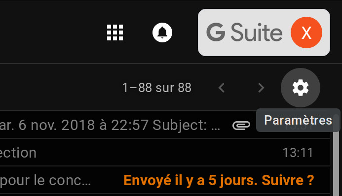
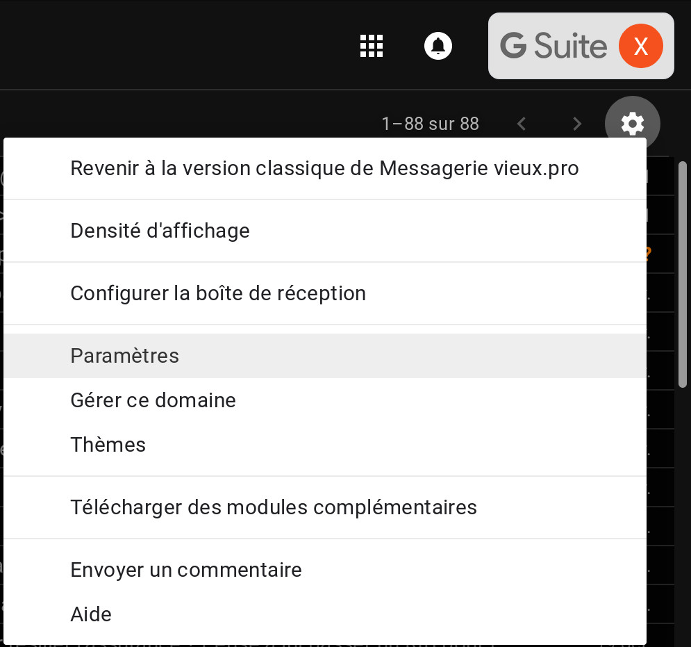
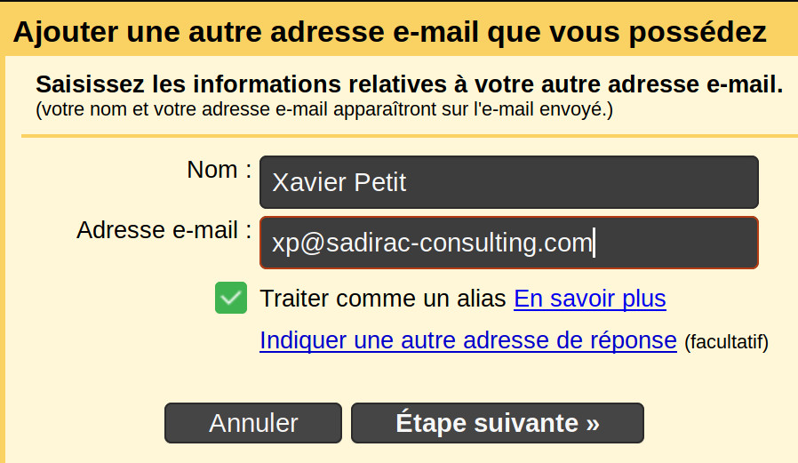
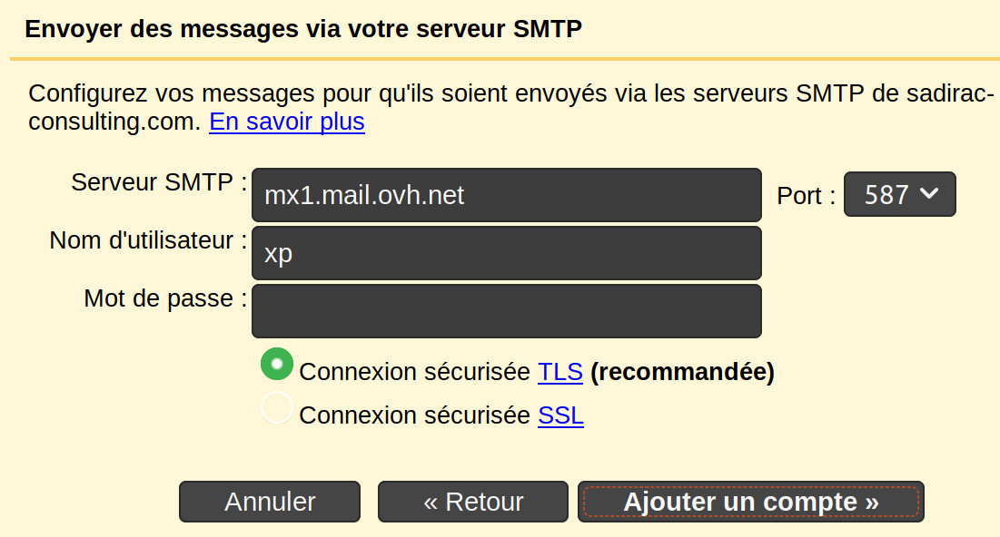
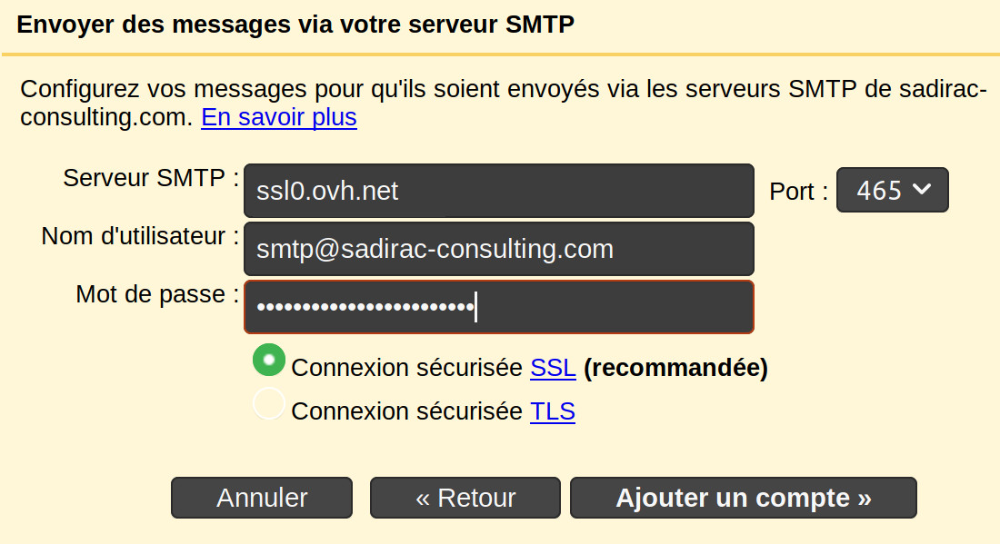
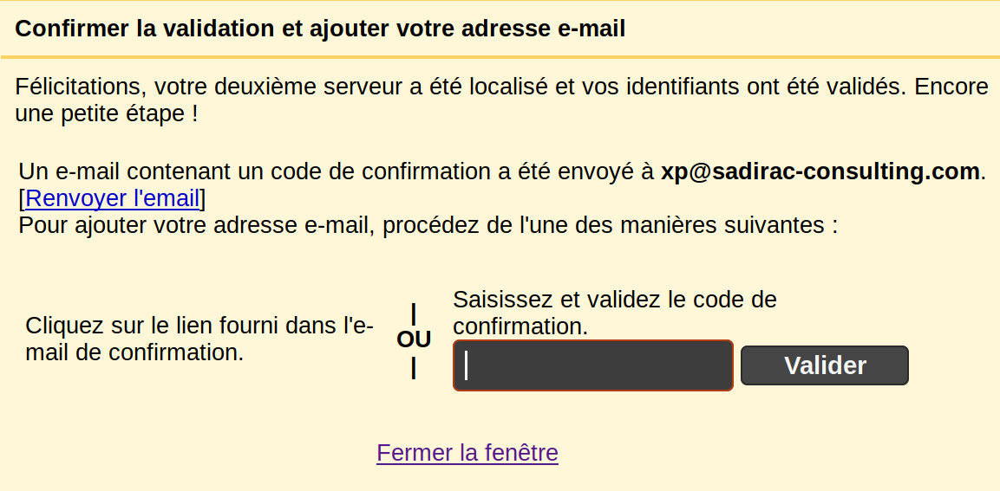

Pour rajouter un alias allez sur Gmail et cliquez sur l'engrenage tout en haut à droite :

Cliquez sur Paramètres :

Cliquez sur Comptes :

Cliquez sur “Ajouter une autre adresse e-mail”

Une popup s'ouvre alors, saisissez votre alias :

Vous arrivez sur une configuration par défaut :

Qu'il faut changer de cette manière :

À cette étape, vous pouvez fermer la popup, il vous faudra ouvrir le lien de confirmation reçu sur votre adresse e-mail :

